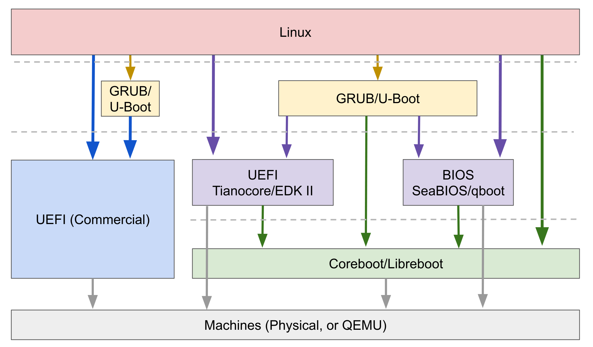

# On Open-Source Firmware Systems Landscape

??? note "Version History"
	|Date|Description|
	|:---|-----------|
	|May 6, 2020| Initial Version|

There are a lot open-source firmware projects.
I was trying to understand their relationship.
After some research, I drew the following landscape figure.

It seems Microsoft Surface is using Project Wu,
their own open-source UEFI layer.
By default, QEMU uses SeaBIOS. But it's easy to use others such as qboot, Tianocore.

Coreboot seems very interesting. It's only doing one job, which is initialize
the very low-level memory controller and on-board resources. It uses cache as memory.

If you are using a normal laptop or desktop, chances are, none of those firmware is used.
Normally machines are shipped with commercial firmwares.

To me, I like SeaBIOS project the best. It's simple and can boot everything we need.
(For example, Linux, LegoOS as well).

Bottom-up:

- Coreboot/Libreboot/UEFI: for motherboard init, e.g., init memory controller.
- UEFI/BIOS
- GRUB2/U-Boto: Bootloader
- OS

The landscape:

