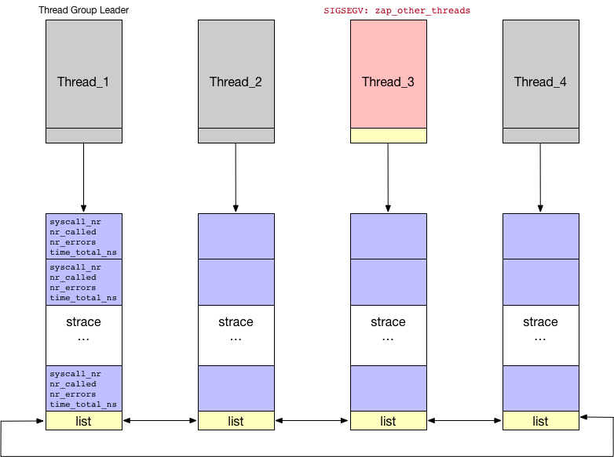

# Lego syscall tracer

Lego has a built-in kernel-version syscall tracer, similar to `strace` utility in the user space. Below we will just call our Lego's syscall tracer as strace for simplicity.

## Design
There are essentially three important metrics to track for each syscall

- number of times invoked
- number of times error happened
- total execution, or per-call latency

Besides, there is another important design decision: 1) should all threads within a process share one copy of data to maintain bookkeeping, or 2) should each thread do its bookkeeping on its own set of data? Our answer is 2). For two reasons:

- Performance: set of counters are `atomic_t`, updating is performed by a locked instruction. The first solution will add huge overhead while tracing heavily multithreaded applications.
- Simplicity: in order to track the latency of each syscall, we need to know when it enter and when it finish. As threads come and go, it is hard to maintain such information. To make it worse, a preemptable kernel, or schedule-related syscalls will move threads around cores.

Below is our simple design, where each thread has a `struct strace_info`, which include a set of counters for each syscall. All `strace_info` within a process are chained together by a doubly-linked list.


When we want to look at the strace statistic numbers, we need to `accumulate` counters from all threads within a process, including those dead threads. We do the `accumulate` when the last thread of this process is going to exit.

The benefit of doubly-linked `strace_info` is we can walk through the list starting anywhere. There is really no list head here. In fact, everyone can be the head. See how we respect equality? Besides, even if `task_struct` is reaped, `strace_info` is still there and linked.

For example, assume thread_3 has a SIGSEGV, and did a `zap_other_threads`. And he is the last standing live thread of this process. When it is going to exit, it will accumulate all the statistic and do the necessary printing.


## Details

There are essentially three hooks in core kernel:

- __syscall__: before and after `sys_call_table`
- __fork/clone__: create `strace_info` for each thread
- __do_exit()__: when group_dead(signal->live==1), accumulate

## Example Output
This one is sorted by `nr_calls`.
```c
[  661.293260] Kernel strace
[  661.324460] Task: 21:21 nr_accumulated_threads: 46
[  661.382070] % time        seconds  usecs/call     calls    errors syscall
[  661.462782] ------ -------------- ----------- --------- --------- ----------------
[  661.553265]   0.27    0.002771112          28        99         0 sys_mmap
[  661.635424]   0.69    0.069574770        1221        57         0 sys_munmap
[  661.719667]   0.18    0.000001804           1        52         0 sys_mprotect
[  661.805987]   0.34    0.000003440           1        47         0 sys_set_robust_list
[  661.899589]   0.83    0.000838168          19        45         0 sys_clone
[  661.982790]   0.44    0.000004498           1        45         0 sys_madvise
[  662.068071]   5.93    1.913799139       79742        24         0 sys_write
[  662.151272]  88.14   32.183171176     1532532        21         3 sys_futex
[  662.234474]   0.75    0.000007554           1         9         0 sys_close
[  662.317674]   0.12    0.000129595          15         9         0 sys_open
[  662.399836]   0.20    0.000208033          27         8         0 sys_read
[  662.481998]   0.41    0.000041655           6         7         0 sys_brk
[  662.563118]   0.29    0.000029249           6         5         0 sys_newfstat
[  662.649440]   0.88    0.000000889           1         4         0 sys_gettimeofday
[  662.739921]   0.45    0.000000454           1         3         0 sys_time
[  662.822082]   0.43    0.000000434           1         2         0 sys_rt_sigaction
[  662.912563]   0.28    0.000000280           1         1         0 sys_getrlimit
[  662.999926]   0.19    0.000000194           1         1         0 sys_arch_prctl
[  663.088327]   0.49    0.000000049           1         1         0 sys_set_tid_address
[  663.181927]   6.47    2.231398551     2231399         1         0 sys_execve
[  663.266168]   0.17    0.000000175           1         1         0 sys_newuname
[  663.352491]   0.24    0.000000247           1         1         0 sys_rt_sigprocmask
[  663.445052] ------ -------------- ----------- --------- --------- ----------------
[  663.535532] 100.00   36.401981466                   443         3 total
```

--  
Yizhou Shan  
Created: April 05, 2018  
Last Updated: April 05, 2018
