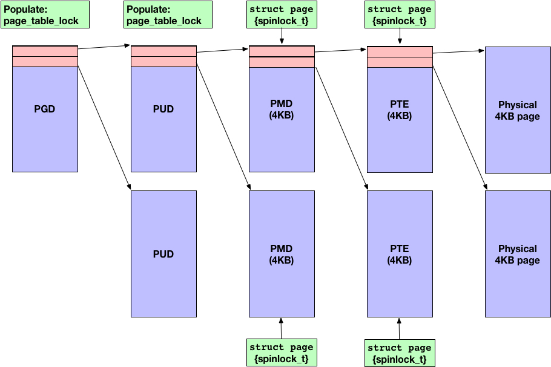

# Fine-grain Page Table Lock

In old Linux or previous Lego, user page table operations, such as set, clear, are protected by `mm->page_table_lock`. This one single lock prohibits a lot parallelisms on big SMP machines. An ideal solution is to have finer-granularity locks, so that faults on different parts of the user address space can be handled with less contention.

But finer-granularity locks means you need more memory for the locks. This is a simple trade-off. Lego currently mimic the Linux x86 default setting[^1], where each PMD _and_ PTE page table pages has their own lock. The lock is a spinlock embedded in the `struct page`. As illustrated below:

Both Processor and Memory managers are using the same mechanism to increase parallelism. And it is something that can improve performance __a lot__.

--  
Yizhou Shan  
Created: Mar 22, 2018  
Last Updated: April 13, 2018

[^1]: [Split page table locks](https://www.kernel.org/doc/Documentation/vm/split_page_table_lock)
