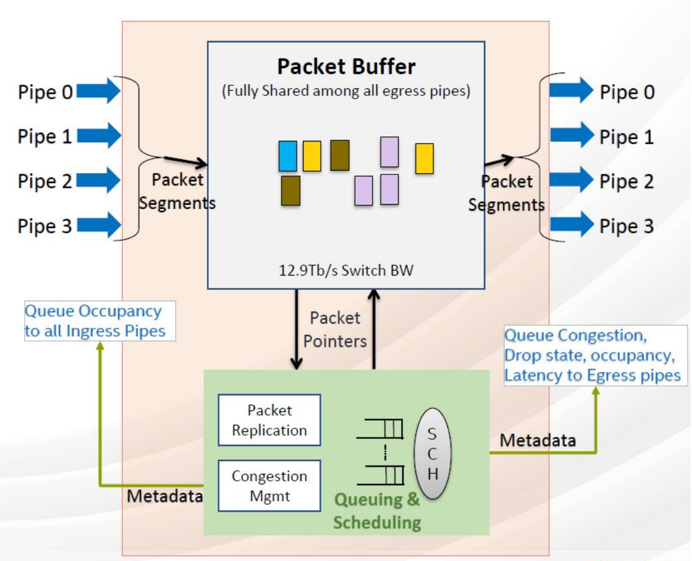
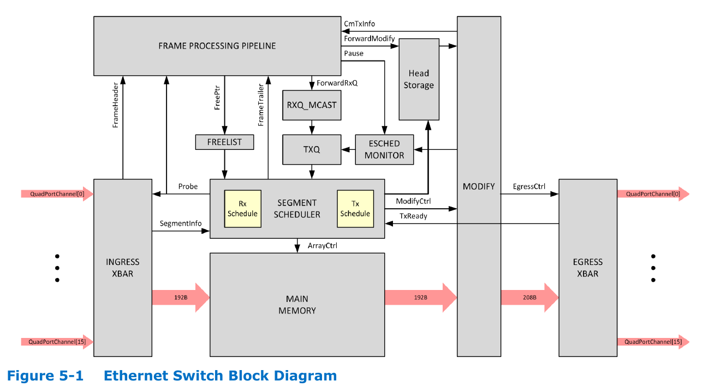
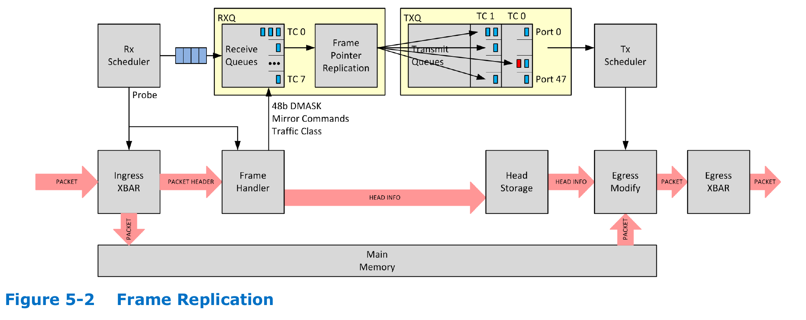

# Switch Buffering and Packet Scheduling

??? note "Version History"
	|Date|Description|
	|:---|-----------|
	|Jan 13, 2021 | more|
	|Jan 12, 2021 | Initial Version|

I came across this topic for a research project I'm doing.

I think the switch buffering architecture and packet scheduling
are closely related. The buffering architecture could limit
what scheduling algorithms can be used.
However, I think they are still two different things
and we should look at them separately.
For example, consider a Combined Input Output Queued Switch,
I think it is possible to use a shared memory to implement
the output queues and use a separate PIFO blocks for packet scheduling.

My current impression for state-of-the-art switches is:
1) They use a large central packet buffer, can be as large as 64MB (i.e., Tofino2);
2) They could have some input and output buffers independent from the central packet buffer,
but these buffers would be small;
3) They have something called Traffic Manager to schedule packets;
4) They usually have fixed packet scheduler. I'm not quite sure whether
they have the programmable packet scheduler concept pioneered by PIFO.

## Switch buffering

List of different switch buffering architectures:

- Input Queued (place buffer after each rx port)
- Virtual Output Queued (each rx port has per-tx queues)
- Output Queued (place buffer before each tx port)
- Combined Input and Output Queued (both rx and tx ports have buffers)
- Shared Memory (depends, it could be a central packet buffer for all tx ports while each tx port still has a small queue)

The Output Queue (OQ) mode has the best performance (see ref-2).
But if there is incast (multiple rx go to one tx), the buffer before each tx
must be able to run N times faster.
Since it is impossible to scale the memory bandwidth with respect to network bandwidth,
the OQ is rarely used now.

On the other hand, the memory in Input Queued (IQ) switch needs only
run as fast as the line rate. This makes input queueing very appealing for switches with fast
line rates, or with a large number of ports.
For this reason, the highest performance switches and routers use input-queued
crossbar switches (ref-2). And a lot recent FPGA-based switch papers are using
the input-queued mode. BUTT, IQ mode suffers from HOL blocking.
So naturally, people came up with the Virtual Output Queued (VOQ) mode,
in which each tx port has a buffer at each rx port.

However, all those IQ, OQ, VOQ, and CIOQ mode can not easily share
the buffers among different ports, i.e., not able to dynamically
partition the buffer usage. (I think) this issue calls for the
shared memory based switch, in which the central packet buffer
can be easily partitioned among tx ports, just a few counters will do.
In fact, the switches I know (though only a few), all use shared memory mode.
For example, the Inte Barefoot programmable p4 switch Tofino2 has a 64MB central packet buffer.

## Packet Scheduling

There is nothing special about packet scheduling, it is just
scheduling a bunch of packets :).
This topic is concerned about in which order to transmit packets
and when to tranmit them. Just like other scheduling work,
there is Work-Conserving v.s. Non-Work-Conserving algorithms.

The simplest algorithm is FIFO. But it could have a lot issues, e.g., HOL blocking.
Since there might be multiple queues waiting to be transmitted, there could be RR,
and weighted RR (WRR). And there are some advanced ones like Strict Priority, Shorted-Time-XXX.

Normally, in our current machine, CPU will do the scheduling rather than the NIC itself.
For example, kernel has Queuing Discipline layer that supports quite a lot algorithms.

With the increasing bandwidth, packet scheduling is more important than before.
It is buring CPU cycles, it may have bad perf, etc.
So people have tried to offload that onto NIC or propose new CPU-friendly algorithms (i.e., Eiffel, NSDI'19 from Google).

Packet scheduling is also a important piece for switches.
Even for programmable switches, this part is not programmable.
So there are work trying to solve that.
The PIFO SIGCOMM'16 paper is for sure one of the seminal work in this space.

To summarize, there are few aspects to consider:
1. where is it running? CPU, NIC, switch, or somewhere else.
2. is it programmable or fixed-function?

## Case Study

Let us look at some real usages out there.

### Linux Kernel

Kernel has a subsystem called queuing discipline, or `qdisc`.
It is a framework to schedule network packets.
It is built in the classical way: a generic layer and a set of ops for callback,
just like how VFS is built.
You can find a lot resources about it online.

Anyhow, you can find the code in `net/sched/sch_*.c`.
You can probably look into `sch_api.c`, `sch_generic.c`, these seem to be general
(e.g., `register_qdisc()`).
The default qdisc is called `pfifo_xxx`, you can do a `git grep` to find it.
It has quite a lot other algorithms like RED in `sch_red.c`.

So all those are software-based packet scheduling implementations.
If you are interested, you can also check out an NSDI'19 paper called `Eiffel`
from Google, which also advocates for software-based packet scheduling.

### Intel Barefoot Tofino2

See [here](https://www.servethehome.com/intel-tofino2-next-gen-programmable-switch-detailed/),
especially the `Traffic Manager` slide:

### Intel FM10000 Multi-Host Switch

This is a shared-memory switch. This is from their spec.
Only payload goes into the shared memory.
Headers go into frame processing pipeline,
in which a lot queues will be formed.

### FPGA-based Switching

For packet scheduling: we need special data structure design.

I'm only aware of these two papers dealing with this:

- PIFO, SIGCOMM'16
- PIEO, SIGCOMM'19

Both of them have a hardware primitive and a framework
to express various packet scheduling algorithms on top of their primitive.

PIFO's source code seems robust and has been used by later projects (e.g., PANIC OSDI'20).
But PIFO's verilog implementation suffers from scalability issue.
It solely uses LUTs to implement its storage and logic, no BRAM is used.
I'm not sure about PIEO.

Q: Will a Softcore-based packet scheduler able to keep up the throughput?
If not, can be customize the softcore to be packet scheduler friendly?
The benefit is probably we can write scheduling algorithm in C (and change freely during runtime)
while have hardware (line rate) performance.

## Final Thoughts

Although the shared memory based switch works for now,
I'm not sure whether it will continue working in the furture.
For one, the network bandwidth is increasing, 200Gbps, 400Gbps.
Will the memory still be able to sustain such high bandwidth? I doubt that.

Also, share memory switch consumes a lot power. Not just the SRAM/DRAM,
but also the SERDES transivers. Those guys consume A LOT energy.
And this is exactly the reason people started looking into circuit switch.

As for packet scheduling, I think there is definitely space for future work.
For example, a better FPGA-friendly programmable framework,
a dynamic framework shifting the packet scheduling task among CPU/NIC/Switch,
a better p4-based algorithm etc.
With the growing network bandwidth, all things should be revisted.

## References

1. The iSLIP scheduling algorithm for *input-queued* switches, 1999
2. Matching Output Queueing with a Combined Input Output Queued Switch, 1999
    - This paper proposed PIFO.
    - It is trying to prove a CIOQ switch can be as good as a output queued switch.
3. Saturating the Transceiver Bandwidth: Switch Fabric Design on FPGAs, 2012
    - Use shared memory as switch.
4. Investigating the Feasibility of FPGA-based Network Switches, 2019
5. High-Performance FPGA Network Switch Architecture, 2020
6. Scheduling Algorithms for High Performance Network Switching on FPGAs: A Survey, 2018

---

1. [Intel® Ethernet Switch FM10000 Series](https://www.intel.com/content/www/us/en/design/products-and-solutions/networking-and-io/ethernet-switch-fm10000-series/technical-library.html?grouping=EMT_Content%20Type&sort=title:asc)
2. Intel Barefoot Tofino2 has a 64MB Unified Packet Buffer 

---

1. PIFO, SIGCOMM'16
2. PIEO, SIGCOMM'19
3. Eiffel, NSDI'19
4. Loom, NSDI'19
5. Programmable Calendar Queue, NSDI'20
6. Carousel, SIGCOMM'17
