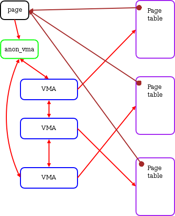
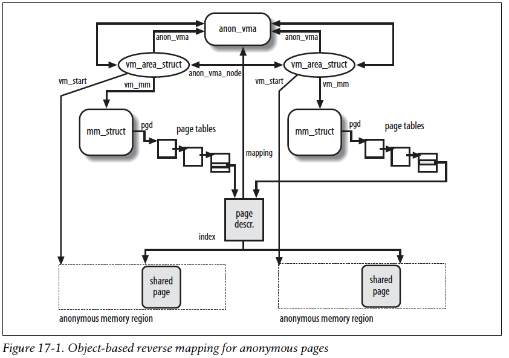

# Linux Reverse Map

:octopus:

Read those carefully, you will understand:

- [PDF: Object-based Reverse Mapping](https://landley.net/kdocs/ols/2004/ols2004v2-pages-71-74.pdf)
- [LWN: Virtual Memory II: the return of objrmap](https://lwn.net/Articles/75198/)
- [LWN: The object-based reverse-mapping VM](https://lwn.net/Articles/23732/)




I used to implement the basic [PTE-chain based rmap for LegoOS](http://lastweek.io/lego/pcache/rmap/).
I can see the downsides of it. I tried to understand the
linux rmap before, somehow gave up because I couldn't fully
understand one thing:
for a page that is shared among multiple processes' VMAs, the source code
suggests it will always have same offset from the beginning of
_all_ VMA (i.e., `vm_start`). But does it actually works like this
for ALL cases? I just think it's possible that a page is mapped
by an VMA which has a slightly different starting address.

I still have doubt about it. But after accepting this assumption,
it's just easy to understand. I will check later on.

The code suggests:

- The offset of a page is saved in `page->index`.
- For anonmouys pages, the `page->index` is saved by [page_set_anon_rmap()](https://github.com/torvalds/linux/blob/e93c9c99a629c61837d5a7fc2120cd2b6c70dbdd/mm/rmap.c#L1027).
- When doing rmap walk over multiple VMAs:
  - For [anon](https://github.com/torvalds/linux/blob/e93c9c99a629c61837d5a7fc2120cd2b6c70dbdd/mm/rmap.c#L1824): `unsigned long address = vma_address(page, vma);`
  - For [file](https://github.com/torvalds/linux/blob/e93c9c99a629c61837d5a7fc2120cd2b6c70dbdd/mm/rmap.c#L1878): `unsigned long address = vma_address(page, vma);`
  - And  `vma_address()` is basically `page->index`

```c
	static inline unsigned long
	__vma_address(struct page *page, struct vm_area_struct *vma)
	{
		pgoff_t pgoff = page_to_pgoff(page);
		return vma->vm_start + ((pgoff - vma->vm_pgoff) << PAGE_SHIFT);
	}
```

Compared to basic PTE-chain based solution, object-based rmap:

__The real benefit__

- During page fault, we only need to set `page->mapping` to point to `struct anon_vma`,
  rather than allocating a new structure and insert.

__The downside__

- During rmap walk, we need extra computation to walk each VMA's page table
  to make sure that the page is actually mapped within this specific VMA.

Adding `struct anon_vma` is really similar to the idea of reusing `address_space`,
i.e., having a data structure trampoline.


Some more boring details:

- All pages within a single VMA share just one `anon_vma`.
  `vma->anon_vma` indicates if a VMA has attached or note.
  Related function is `anon_vma_prepare()` within `do_anonymous_fault()` [1](https://github.com/torvalds/linux/blob/e93c9c99a629c61837d5a7fc2120cd2b6c70dbdd/mm/memory.c#L2948).

--  
Yizhou Shan :copyright:  
Created: Jun 16, 2019  
Last Updated: Jun 17, 2019
