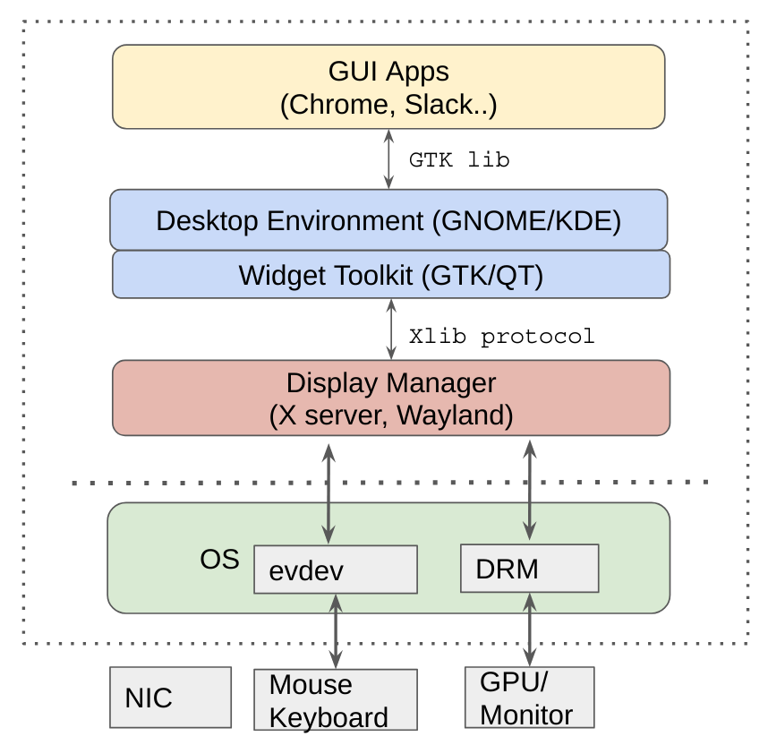
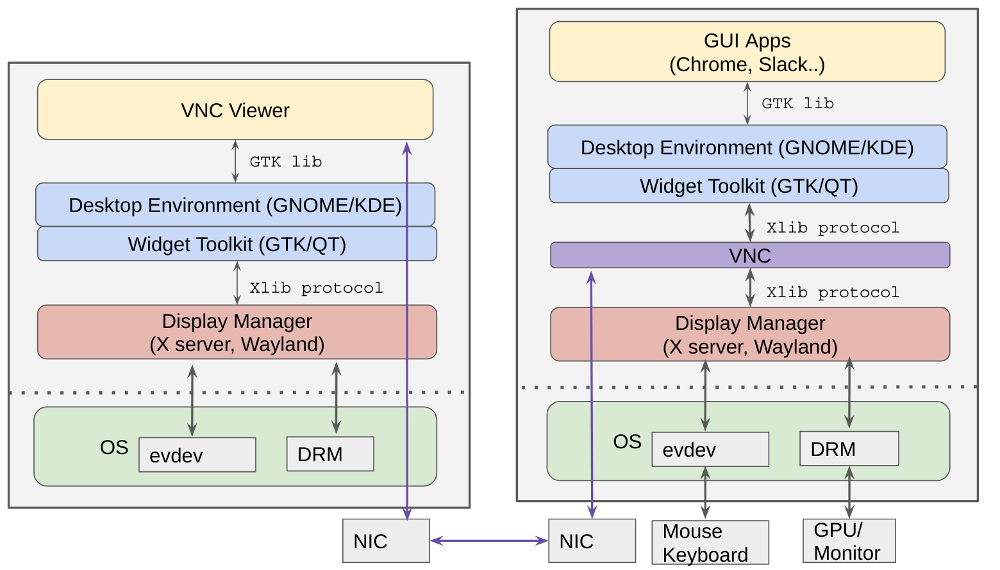
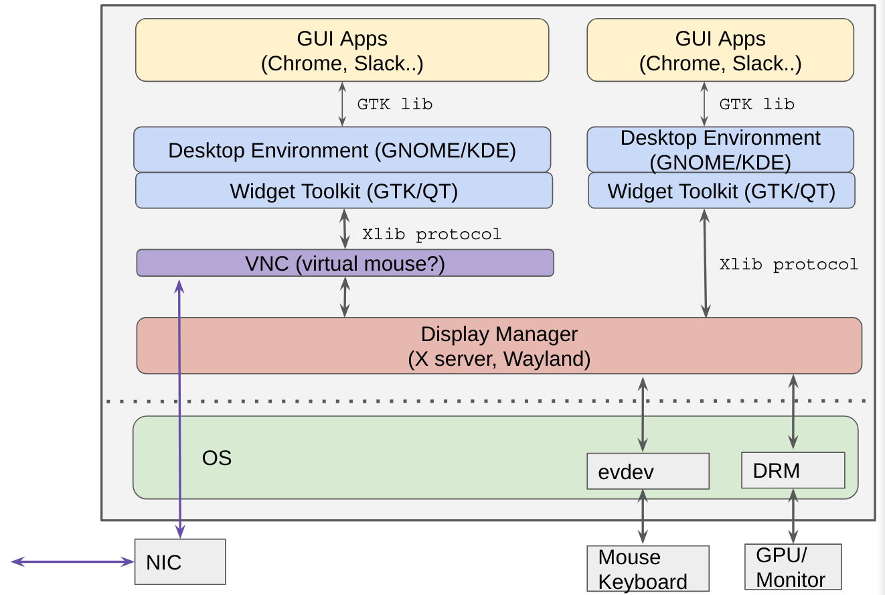

# On Unix Graphic Softwares

??? note "Version History"
	|Date|Description|
	|:---|-----------|
	|May 1, 2020| Initial Version|

For work reason, I use VNC a lot recently. I need to login into our lab's servers and perform
intensive graphic operations. Somehow I'm not a fan of GUI-based systems,
but it really got me wonder: how VNC works? Or, how graphics/GUI works in general?

So I decided to look it up. The whole thing was very complex to me at the beginning.
There are numerous layers of systems, and it not clear who is doing what.
After getting a better understanding, I realize it is "do one thing and do it well" works at its best:
Each layer of the graphic stack is doing what it is supposed to do, nothing more and nothing less.
Even though the line blurred over the years (i think), the principle persists. I like it.

I'm no where near explaing the whole thing well (still a bit confused myself :)).
But you can find awesome references at:

1) [Wiki Display Server](https://en.wikipedia.org/wiki/Display_server),
2) [Wayland Architecture](https://wayland.freedesktop.org/architecture.html)
3) [StackExchange Difference between Xorg and Gnome/KDE/Xfce](https://unix.stackexchange.com/questions/345344/difference-between-xorg-and-gnome-kde-xfce)
4) https://en.wikipedia.org/wiki/Free_and_open-source_graphics_device_driver

Following are some figures I drew to show the architecture of all these softwares.
In the graphic world, kernel's involvement is minimal, but a critical one.
Kernel mainly need to deliver mouse/keyboard events, render frames via graphic cards,
handle network. In other words, kernel provides a mechanism.
The policy is left to userspace stacks.

At the lowest level, we have Display Manager, or Display Server.
Downstream, this layer interact with kernel, i.e., getting keyboard/mouse events from kernel evdev framework,
rendering frames via DRM interfaces.
Upstream, this layer accepts request from their clients (i.e., the widget layer) and make them happen in real displays.
Typical systems at this layer are X.org server and Wayland. They follow the client-server model,
communication has a certain protocol and is via socket (I guess?). 

Next up, is the [widget toolkit](https://en.wikipedia.org/wiki/Widget_toolkit), or UX library layer.
The famous GTK/Qt belong to this layer.
What this layer is doing? So this one is a collection of widgets, like buttons, menu, dropdown,
i.e., GUI elements. Both GTK/Qt offer a lot such stuff (if you are using GNOME desktop, try run `gtk3-widget-factory`).
This layer ask the display manager layer (e.g. X.org server) to display stuff.

GNOME/KDE are [desktop envionment](https://en.wikipedia.org/wiki/Desktop_environment),
they present the whole desktop experience, it includes many applications built based on GTK and Qt, respectively.
You probably have seen `gnome-shell`, yup, this is GNOME's main program.

The highest layer is user applications, like Chrome (which [by default uses GTK on linux](http://dev.chromium.org/developers/design-documents/conventions-and-patterns-for-multi-platform-development), code on `ui/gtk`).
All these linux GUI applications, they are usually built on top of either GTK or Qt's libraries.
That being said, if you want to develop GUI-based apps on Linux, chances are, you
will use either of the libraries.

This is a landscape overview:

But how [VNC](https://en.wikipedia.org/wiki/Virtual_Network_Computing) fits into the big picture?
In short, VNC sits in the middle between X and GTK/Qt.
On one hand, VNC appears as a client of X. On the other, VNC appears as an X server to GTK/Qt.
Middleman works at its best lol. There are, however, many different implementation choices.
If you have used TigerVNC, which in turn uses Xvnc, its [man page](https://tigervnc.org/doc/Xvnc.html) says:
*Xvnc is the X VNC (Virtual Network Computing) server. It is based on a standard X server, but it has a "virtual" screen rather than a physical one. X applications display themselves on it as if it were a normal X display, but they can only be accessed via a VNC viewer - see vncviewer(1). So Xvnc is really two servers in one. To the applications it is an X server, and to the remote VNC users it is a VNC server.*

Thus it looks like this with VNC:

A machine have multiple such instances, thus multiple virtual and physical display can coexist.
And for that, I think it's all because of the clear separation of layers and good engineering
(man, those graphic framebuffer code is monstrous):

This post remind me of ["What happens when you type google.com into your browser and press enter?"](https://github.com/alex/what-happens-when)?

As always, hope you enjoyed this blog.
